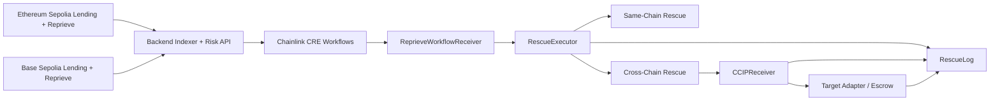
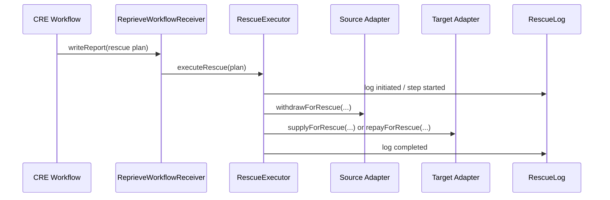
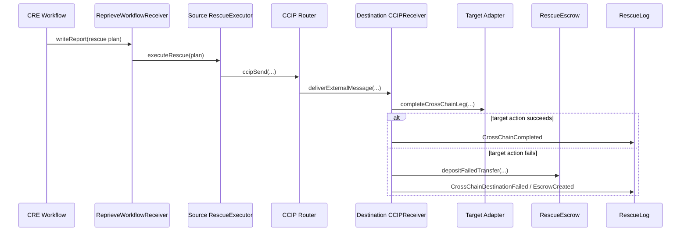

# Reprieve x Chainlink

Smart contracts, Chainlink Runtime Environment workflows, and backend infrastructure for the Reprieve cross-chain rescue proof of concept.

This repository contains:
- EVM smart contracts for lending markets, adapters, rescue execution, cross-chain settlement, audit logging, escrow fallback, and CRE-compatible receivers
- 3 Chainlink CRE workflows that read onchain and backend state, evaluate risk, and submit rescue plans onchain
- A NestJS + Postgres backend for position indexing, risk snapshots, relay automation, demo wallet onboarding, and CRE registration/log APIs

## Progress Snapshot

### Product Capability Status

| Domain | Feature | Status | Notes |
|---|---|---|---|
| Contracts | Lending stack | Done | Aave, Compound, and Morpho adapters on Ethereum Sepolia and Base Sepolia |
| Contracts | Rescue execution | Done | Same-chain and cross-chain rescue execution through `RescueExecutor` |
| Contracts | Cross-chain settlement | Done | Router + destination receiver + escrow fallback path |
| Contracts | Audit logging | Done | `RescueLog` and execution status tracking onchain |
| Contracts | CRE receiver | Done | `ReprieveWorkflowReceiver` accepts signed workflow reports and forwards rescue plans |
| CRE | Chainlink API Guard V1 | Done | Position-aware rescue planning with same-chain/cross-chain routing |
| CRE | Quant Funding/OI V1 | Done | Guard flow plus funding/open-interest reasoning |
| CRE | Quant Basis/Liquidity V1 | Done | Guard flow plus basis/liquidity reasoning |
| Backend | Position indexing + risk snapshots | Done | Cross-chain snapshot aggregation, HF recomputation, what-if pricing |
| Backend | Cross-chain relay worker | Done | Reads pending relay jobs from DB and relays cross-chain messages |
| Backend | Demo wallet onboarding | Done | Deterministic demo wallets, funding, position bootstrap |
| Backend | CRE config + run log APIs | Done | User workflow registration and run-log storage/query |

### Engineering Maturity Status

| Area | Status | Notes |
|---|---|---|
| Smart contract scope | Advanced PoC | Broad coverage across lending, rescue execution, routing, and logging |
| CRE workflow scope | Advanced PoC | Deterministic planning logic with signed report flow and test coverage |
| Backend scope | Demo-ready | Strong debugging and operator tooling, not hardened for production scale |
| Test coverage | Good for PoC | Foundry + Bun/TypeScript tests across contracts and workflows |
| Security posture | PoC | Trusted owner keys, managed demo wallets, no formal audit |
| Production readiness | Not targeted | Operator and onboarding assumptions remain throughout relay, wallet management, and oracle systems |

## Chainlink Usage

This repo uses Chainlink in two ways:

### 1. Chainlink Runtime Environment

- CRE workflows live under `cre/`
- each workflow uses `@chainlink/cre-sdk`
- `ReprieveWorkflowReceiver` is the onchain report consumer
- workflows are simulated with CRE CLI against Sepolia/Base Sepolia RPC targets from `cre/project.yaml`

Key workflow entrypoints:
- `cre/reprieve-chainlink-api-guard-v1/main.ts`
- `cre/reprieve-quant-funding-oi-v1/main.ts`
- `cre/reprieve-quant-basis-liquidity-v1/main.ts`

### 2. Cross-Chain Rescue Messaging

- Router contracts handle cross-chain message dispatch and delivery
- `CCIPReceiver.sol` consumes destination messages
- backend relay worker or `scripts/ops.sh cross-chain-rescue-relay ...` advances the destination leg

## Deployed Contracts

Current deployment summary sourced from `contracts/config/`.

### Ethereum Sepolia

| Contract | Address |
|---|---|
| Price Oracle | `0xf7FF29381Be343398e014cB00d48A1c4698BD224` |
| Collateral Token (WETH) | `0x4c87EA388AdE37f6A556146B4fF6ff2A12192968` |
| Debt Token (USDC) | `0x7C31b54EB6712B308cf27aA7e8d2012DcfA92E4E` |
| Aave Pool | `0x9707e23823836DfC7d46866a107F7b0374c39703` |
| Compound Market | `0x050E7a763Cb1C8071C0A2003F5Fda0d9d87a581b` |
| Morpho Market | `0x669a53533817Edc2189612bc0b5af72eD38Bfff3` |
| Aave Adapter | `0x9a2389d74e6318C67824339e37450437b4De7027` |
| Compound Adapter | `0x571cf1d4fbeae893E02bA61Df5B0E9D5B7311dBa` |
| Morpho Adapter | `0x2444d3079CB7e248BA35044250d4448f8Bb3Bc68` |
| Adapter Registry | `0xCc06e00C429A70bedDB7D17c7c88f5511Ed4f16d` |
| Rescue Log | `0xaB1eF61204443CfAfFA4D9A3593F7B0bC72d5C64` |
| Rescue Escrow | `0x4334A2aBdBCCA93F329C2a958ef97E50CFF46049` |
| Rescue Executor | `0x99B6e30b737F1D451B44F8369d3EC1809ab25262` |
| CCIP Receiver | `0xD88Ca3501A08Fa70ef95415512b68C013aAdfd99` |
| Health Monitor | `0xCf5B6d1B877e8df38BAbFE848e47A3c8ce36df79` |
| Workflow Receiver | `0x860Cde8737998D6166340d485ad68f49B5d6C3e9` |
| CCIP Router | `0xf8Ca6FCf3916D689F2158073806333f1FFB9e87e` |
| LINK Token | `0x779877A7B0D9E8603169DdbD7836e478b4624789` |

### Base Sepolia

| Contract | Address |
|---|---|
| Price Oracle | `0x1CB5b9fc0F24D26366aA8F2aeFE875fD356f4616` |
| Collateral Token (WETH) | `0xEDD391FDa28993287Df301485ABF72865dee5050` |
| Debt Token (USDC) | `0x7570E1f97e0831E929B9525858586E274F5C9cf2` |
| Aave Pool | `0xAAe3161d6D8E859aa13A1716886e030D14b20e15` |
| Compound Market | `0xcD8D9dB3C927d4382d21b9113162ec5f80a6AeB1` |
| Morpho Market | `0x7dF1CE47d9Dc3fC2eC75554706a660c1C0B07d03` |
| Aave Adapter | `0x3Ce2A7601623bdB7aF942eD07BF185b5a8CF0cd9` |
| Compound Adapter | `0xA10dD58EcAdf3fd071a23415e55FD23287d684bc` |
| Morpho Adapter | `0x325fADdd2B7F0B3f7ab8E5113F31a4C208669f44` |
| Adapter Registry | `0x587fBE3fEccbB6300E8AB732093B31a9B503620B` |
| Rescue Log | `0x4f20e421203604D3A337f20807418A933124dE33` |
| Rescue Escrow | `0x688426E9ac2129b9AE815C0f4E36aDa65a31AFA0` |
| Rescue Executor | `0xd1581fe379Be0F9E0aC835Aca2B02959C18B5e43` |
| CCIP Receiver | `0xF03b518f9CF3F81B2A0BE048f2d73a6b624d2C27` |
| Health Monitor | `0xC4219Be02e4d7DEc56424162E9f535268E14B263` |
| Workflow Receiver | `0x02979441a188DfDe7C1f6d45f3F0589dFEc15BE7` |
| CCIP Router | `0xAE39156C5FCBAB6E5CfaBbdaDD3207aCd2BAdeac` |
| LINK Token | `0xE4aB69C077896252FAFBD49EFD26B5D171A32410` |

## Architecture Overview

- Lending positions live on Ethereum Sepolia and Base Sepolia.
- Reprieve contracts monitor those positions through adapters and execute rescues.
- CRE workflows evaluate risk and submit rescue plans through `ReprieveWorkflowReceiver`.
- The backend indexes positions/events, exposes risk APIs, manages demo wallets, and runs relay automation.



## Core Architecture Flows

### 1. Same-Chain Rescue Flow

CRE reads current position state, computes a rescue plan, submits a signed report to `ReprieveWorkflowReceiver`, and the receiver forwards the decoded plan to `RescueExecutor`.



### 2. Cross-Chain Rescue Flow

The source leg withdraws from the healthy position and dispatches a cross-chain message. The destination leg either completes the rescue or escrows the transferred funds if the target action cannot be completed.



## Repository Scope

- `contracts/`: Foundry project for lending, adapters, Reprieve contracts, deployment scripts, and tests
- `cre/`: Chainlink CRE workflows, shared libraries, workflow configs, and tests
- `backend/`: NestJS + Postgres service for indexing, relay, demo wallets, and operator APIs
- `scripts/`: operator CLIs for deployment, rescue execution, oracle price setting, workflow receiver debugging, and local backend helpers
- `specs/`: design docs and vertical-slide implementation plans

Out of scope for this repository:
- frontend UI
- production bridge integrations
- production lending integrations
- production key management / custody

## Smart Contract System

| Contract | Purpose |
|---|---|
| Aave-like pool | Aave-style lending market |
| Compound-like market | Compound-style lending market |
| Morpho-like market | Morpho-style lending market |
| `AaveLikeAdapter.sol` | Source/target adapter for Aave-like market |
| `CompoundLikeAdapter.sol` | Source/target adapter for Compound-like market |
| `MorphoLikeAdapter.sol` | Source/target adapter for Morpho-like market |
| `RescueExecutor.sol` | Core rescue planner/executor on source chain |
| `CCIPReceiver.sol` | Destination-side cross-chain completion entrypoint |
| `RescueEscrow.sol` | Stores bridged funds when destination completion fails |
| `RescueLog.sol` | Canonical rescue event log and audit trail |
| `ReprieveWorkflowReceiver.sol` | CRE-compatible onchain receiver for signed reports |
| CCIP router | Cross-chain message router used by rescue flow |
| Price oracle | Onchain oracle used by lending markets and backend/CRE pricing |

## CRE Workflow System

| Workflow | Trigger | Primary Inputs | Contract Write |
|---|---|---|---|
| `CHAINLINK_API_GUARD_V1` | HTTP | indexed positions, onchain prices, rescue policy | `ReprieveWorkflowReceiver` |
| `QUANT_FUNDING_OI_V1` | HTTP | guard inputs + funding/open-interest reasoning | `ReprieveWorkflowReceiver` |
| `QUANT_BASIS_LIQUIDITY_V1` | HTTP | guard inputs + basis/liquidity reasoning | `ReprieveWorkflowReceiver` |

Each workflow lives under:
- `cre/reprieve-chainlink-api-guard-v1/`
- `cre/reprieve-quant-funding-oi-v1/`
- `cre/reprieve-quant-basis-liquidity-v1/`

Shared CRE target RPC settings live in:
- `cre/project.yaml`

## Backend System

| Module | Purpose |
|---|---|
| Positions | Indexes user positions and builds CRE-style risk snapshots |
| Rescue History | Indexes rescue events, reconstructs rescue executions, rebuilds projections |
| Relay | Finds pending cross-chain initiations and relays destination delivery |
| Demo Wallets | Generates managed demo wallets, funds balances, bootstraps risk scenarios |
| CRE Registrations | Stores user-selected workflow + policy config |
| API | Health + Swagger + operational REST endpoints |

Important backend features:
- risk snapshot API with optional what-if price overrides
- API-guard simulation API matching CRE rescue planning logic
- demo wallet portfolio, funding, and bootstrap APIs
- CRE log storage/query API
- `contracts-config/` copied into backend so it can deploy independently of the contracts workspace

## Repository Structure

```text
.
├── backend/
│   ├── src/
│   ├── contracts-config/
│   ├── docker-compose.yml
│   ├── Dockerfile
│   └── package.json
├── contracts/
│   ├── src/
│   ├── script/
│   ├── test/
│   ├── config/
│   └── foundry.toml
├── cre/
│   ├── reprieve-common/
│   ├── reprieve-chainlink-api-guard-v1/
│   ├── reprieve-quant-funding-oi-v1/
│   ├── reprieve-quant-basis-liquidity-v1/
│   └── project.yaml
├── scripts/
│   ├── ops.sh
│   ├── backend/
│   └── reprieve/
├── specs/
├── README.example.md
└── README.md
```

## Local Development

### Smart Contracts

Prerequisites:
- Foundry
- `.env` populated from `.env.example`

Commands:

```bash
cd contracts
forge build
forge test -vv
```

Common operator commands:

```bash
./scripts/ops.sh lending-deploy ethereum-sepolia
./scripts/ops.sh reprieve-deploy ethereum-sepolia
./scripts/ops.sh workflow-receiver-deploy ethereum-sepolia
./scripts/ops.sh workflow-receiver-wire ethereum-sepolia
./scripts/ops.sh set-oracle-price ethereum-sepolia WETH 1850.25
./scripts/ops.sh deposit-collateral ethereum-sepolia WETH AAVE 1.5
./scripts/ops.sh borrow-asset ethereum-sepolia USDC COMPOUND 2500
./scripts/ops.sh cross-chain-rescue-relay ethereum-sepolia base-sepolia latest
```

### CRE Workflows

Prerequisites:
- Bun
- CRE CLI

Install and build per workflow:

```bash
cd cre/reprieve-chainlink-api-guard-v1
bun install
bun run build
```

Simulation examples:

```bash
cre workflow simulate ./reprieve-chainlink-api-guard-v1 \
  --target=staging-settings \
  --non-interactive \
  --trigger-index 0 \
  --http-payload '{"user":"0x7FbBC4ABd42f91a6e3861D33a67DeC13558658b5","runMode":"dry_run"}'

cre workflow simulate ./reprieve-quant-funding-oi-v1 \
  --target=staging-settings \
  --non-interactive \
  --trigger-index 0 \
  --http-payload '{"user":"0x7FbBC4ABd42f91a6e3861D33a67DeC13558658b5","runMode":"dry_run"}'

cre workflow simulate ./reprieve-quant-basis-liquidity-v1 \
  --target=staging-settings \
  --non-interactive \
  --trigger-index 0 \
  --http-payload '{"user":"0x7FbBC4ABd42f91a6e3861D33a67DeC13558658b5","runMode":"dry_run"}'
```

### Backend

Prerequisites:
- Node.js 20+
- Postgres 16

Local dev:

```bash
cd backend
npm install
npm run migration:run
npm run dev
```

Useful backend jobs:

```bash
cd backend
npm run indexer:once
npm run relay:once
npm run projection:rebuild
```

Swagger:

```text
http://localhost:3001/docs
```

### Backend Docker

The backend can be run as 3 processes with a shared Postgres:
- `api`
- `indexer`
- `relay`

Commands:

```bash
cd backend
docker compose up --build
```

## Environment Notes

Root environment:
- `.env.example` documents deployer keys, chain RPCs, and contract/operator variables used by `scripts/ops.sh`

Backend environment:
- `backend/.env.example` documents DB config, RPC URLs, contract-config location, relay settings, and demo wallet settings

Important backend envs:
- `ETHEREUM_SEPOLIA_RPC_URL`
- `BASE_SEPOLIA_RPC_URL`
- `CONTRACTS_CONFIG_DIR`
- `ETHEREUM_SEPOLIA_PRIVATE_KEY`
- `BASE_SEPOLIA_PRIVATE_KEY`
- `DEMO_WALLET_MASTER_SECRET`
- `DEMO_WALLET_ENCRYPTION_KEY`

## Specs and Design Docs

Key documents:
- `specs/spec.md`
- `specs/reprieve-contracts-design.md`
- `specs/reprieve-cre-workflow-design.md`
- `specs/reprieve-cre-implementation-plan.md`
- `specs/reprieve-backend-nest-design.md`
- `specs/reprieve-backend-implementation-plan.md`
- `specs/ccip-smart-contract-dev-guide.md`

## Current Assumptions and Constraints

- Backend may manage demo-wallet private keys for onboarding flows
- CRE policies are operator oriented, not user-self-custody hardened
- Oracle and quant inputs are designed for deterministic workflow behavior, not production data quality guarantees

## Current Focus

- polish end-to-end flows across contracts, CRE, and backend
- keep risk snapshot and CRE planning logic aligned
- improve operator ergonomics through API, relay, and scripting tools
- preserve a clean upgrade path from current workflows to richer production-grade signal inputs
