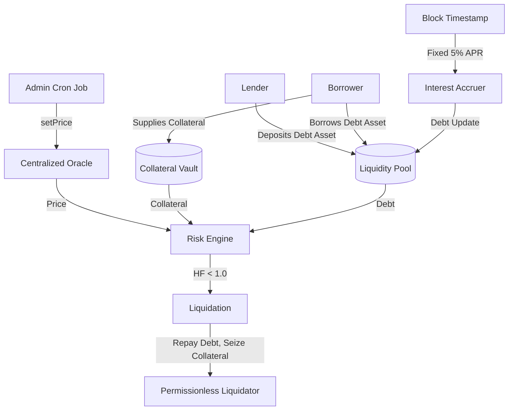

# Reprieve Demo Lending Spec (Merged)

## Goal
Define a single, minimal lending-model specification for Sepolia demo protocol mimics used by Reprieve on Ethereum Sepolia and Base Sepolia.

## System Architecture

## Economic Baseline (Applies To All Mimics)
- Single debt asset pool (USDC-like).
- Single volatile collateral asset (WETH-like).
- Centralized owner-updated oracle via `setPrice(uint256)`.
- Target oracle update cadence: every 60 seconds (external cron).
- `maxLtvBps = 7500` (75%).
- `liquidationThresholdBps = 8000` (80%).
- Fixed borrow rate: `5% APR` with elapsed-time accrual.
- Permissionless `liquidate(address user)` with fixed 5% liquidation bonus.

## Demo Decision
- Use self-deployed protocol-mimic contracts instead of official Aave/Compound/Morpho Sepolia deployments.
- Reprieve adapters integrate only against these mimic instances for the demo path.

## Contract Set (Per Chain)
- `MockAavePool.sol` + `MockAToken.sol`
- `MockCompoundMarket.sol` + `MockCToken.sol`
- `MockMorphoMarket.sol` + `MockVaultShare.sol`
- `MockPriceOracle.sol`
- `MockERC20.sol` (collateral/debt assets)

## Minimal Contract Surface
- Position reads:
  - `getUserPosition(address user) -> collateral, debt, ltvBps, liquidationThresholdBps`
  - `getHealthFactor(address user, uint256 price) -> hfWad`
- User actions:
  - `supply(address asset, uint256 amount, address onBehalfOf)`
  - `withdraw(address asset, uint256 amount, address to)`
  - `borrow(address asset, uint256 amount, address onBehalfOf)`
  - `repay(address asset, uint256 amount, address onBehalfOf)`
- Admin/config:
  - `setRiskParams(...)`
  - `setPaused(bool)`
  - optional deterministic setup helper: `setUserPosition(...)`
- Liquidation:
  - `liquidate(address user)`

## Required Behavior
- Enforce ERC20 approval checks on `supply` and rescue-related token pulls.
- Enforce max borrow from current oracle price and 75% max LTV.
- Compute health factor using 80% liquidation threshold.
- Accrue debt with fixed 5% APR.
- `withdraw` reverts when safety/reserve constraints are violated.
- Allow permissionless liquidation only when `HF < 1.0`.
- Emit consistent events:
  - `PositionUpdated`
  - `Supplied`
  - `Withdrawn`
  - `Borrowed`
  - `Repaid`

## Reprieve Adapter Expectations
- Protocol-style adapters:
  - `AaveLikeAdapter`
  - `CompoundLikeAdapter`
  - `MorphoLikeAdapter`
- Shared adapter interface:
  - `discoverPositions(user) -> Position[]`
  - `healthFactor(user) -> uint256`
  - `availableCollateral(user, asset) -> uint256`
  - `withdrawForRescue(user, asset, amount, to)`
  - `repayForRescue(user, asset, amount, targetUser)`

## Simplifications (Intentional)
- No utilization-based/dynamic rate model.
- No full liquidation auction engine.
- No governance/incentives/fees.
- No upgradeability requirements.
- No full ABI parity with real Aave/Compound/Morpho.
- No detailed Comet internals (indexes, absorb flow, rewards, or protocol-specific accounting).

## Deployment Matrix
- Deploy full mock set to Ethereum Sepolia.
- Deploy full mock set to Base Sepolia.
- Seed deterministic user positions on both chains.
- Persist addresses in chain-specific config for CRE + backend adapters.

## Acceptance Criteria
- At least one discoverable position per protocol style per chain.
- HF can be moved above/below threshold by oracle price updates.
- Same-chain rescue works end-to-end against mocks.
- Cross-chain rescue path works using chain A source and chain B target mocks.
- Liquidation can be demonstrated deterministically when HF drops below 1.0.
