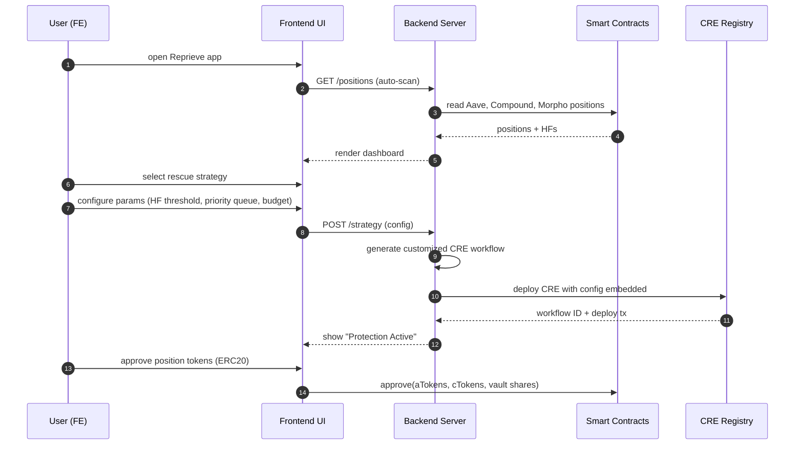
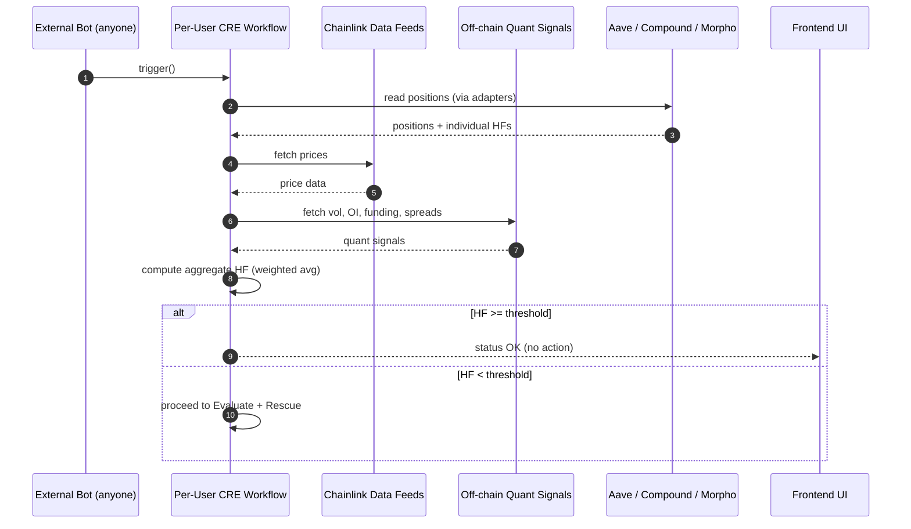
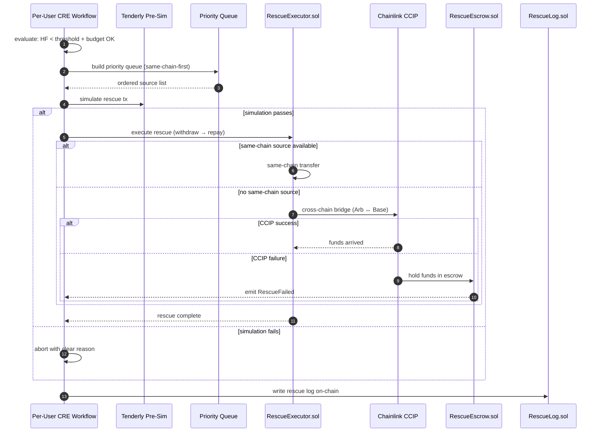
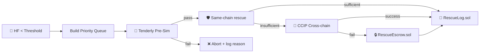
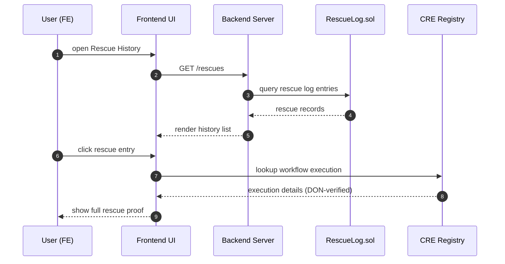
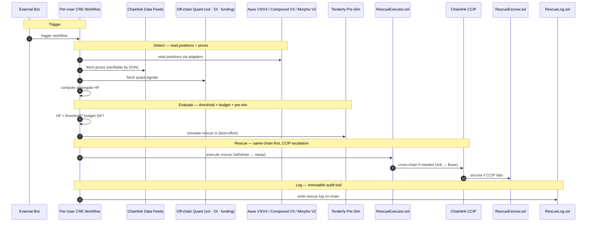

# Reprieve — Jobs to be Done

<aside>
🎯

**JTBD framework** — what users are *actually* trying to accomplish, not features

</aside>

---

## Core Job

> **When** I have leveraged positions across multiple DeFi protocols and chains, **I want to** automatically detect liquidation risk and rescue my collateral before it's too late, **so that** I never lose funds to a liquidation I could have prevented — without trusting a centralized bot.
> 

---

## User Stories

### 1. Monitor — "One dashboard, all my risk"

*When I have positions across Aave, Compound, and Morpho, I want to see all my health factors in one place with a single aggregate risk score, so I don't have to check each protocol manually.*

**Success criteria:**

- [ ]  Dashboard auto-scans existing positions from Aave V3/V4, Compound V3, Morpho V2 via protocol adapters — no manual import
- [ ]  Each position shows: protocol, chain, collateral type, debt, individual health factor
- [ ]  Aggregate health factor computed using Chainlink Data Feeds + off-chain quant signals (vol, OI, funding, spreads)
- [ ]  Live updates — positions refresh on each CRE trigger cycle
- [ ]  ERC20 position tokens supported (aTokens, cTokens, vault shares)
- [ ]  Demo uses mock adapters; mainnet uses real ABIs/APIs with same adapter structure

*Emotional driver:* "I have $50K spread across three protocols and two chains. Checking each one is a full-time job. I just want one number that tells me if I'm safe."

*Competitors:* DeFi Saver (Aave + Compound only, single-chain) · InstaDapp (dashboard but manual exits only, no aggregate HF) · Zapper/DeBank (view-only, no protection) · Protocol-native dashboards (one protocol at a time, no cross-protocol risk view)

### 2. Protect — "Set it and forget it"

*When I see my aggregate health factor, I want to configure automatic protection with my own thresholds and priorities, so my positions are rescued before liquidation without me watching charts 24/7.*

**Success criteria:**

- [ ]  User selects a rescue strategy (1 strategy = 1 CRE per user)
- [ ]  Configurable params: HF threshold (default 1.30), priority queue order, budget cap (per-rescue + daily)
- [ ]  User pays LINK → app generates a customized CRE workflow with config embedded → deploys on-chain
- [ ]  Per-token ERC20 approval for position tokens (aTokens, cTokens, vault shares) — pre-approved in demo
- [ ]  Protection coverage calculator shows required reserve vs current delegated capacity
- [ ]  Emergency override: if any single protocol HF < 1.10, force rescue regardless of aggregate
- [ ]  CRE workflow is verifiable by DON — trustless, no centralized operator

*Emotional driver:* "I lost $12K to a liquidation on Aave while I was asleep. My Compound position had plenty of spare collateral. If something had just moved it over, I'd be fine."

*Competitors:* DeFi Saver (automated protection but single-protocol, single-chain, centralized bots) · Gelato Network (flexible automation but no cross-protocol health aggregation, no quant signals) · Concrete Protocol (ERC-4626 vault-based, pool protection not structural rescue) · Manual alerts via Tenderly/Telegram (notifications only, zero execution)

### 3. Rescue — "Save my position, any chain"

*When my aggregate health factor drops below my threshold, I want collateral automatically moved from the safest source to the endangered position — even across chains — so my position is saved without manual intervention.*

**What runs where (so the story is unambiguous):**

- **CRE workflow (per-user, bot-triggered):** detect positions → fetch prices via Data Feeds → compute aggregate HF with off-chain quant → evaluate threshold → build priority queue → execute rescue → log on-chain
- **On-chain (contracts):** `RescueExecutor.sol` executes withdraw → repay; `RescueEscrow.sol` holds funds if CCIP fails; `RescueLog.sol` writes audit trail
- **Cross-chain (CCIP):** bridges collateral from source chain to target chain when no same-chain source is available

**Success criteria:**

- [ ]  Same-chain-first rescue via priority queue (highest HF source first = safest to withdraw from)
- [ ]  CCIP cross-chain rescue as escalation when no same-chain source available (Arbitrum Sepolia ↔ Base Sepolia)
- [ ]  Tenderly pre-simulation before execution — best-effort: abort with clear reason on fail
- [ ]  Budget guard enforces per-rescue cap (0.05 ETH) + daily cap (0.2 ETH)
- [ ]  Recovery buffer: rescue aims to bring HF to threshold × 1.10 (e.g., 1.30 → 1.43)
- [ ]  Source reserve: never withdraw more than 80% of source's available collateral
- [ ]  `RescueEscrow.sol` holds funds on source chain if CCIP fails — user can claim or protocol retries
- [ ]  Cross-chain lock: `rescueInProgress[user]` blocks concurrent rescues while CCIP in flight
- [ ]  Fall-through: if source #1 has insufficient collateral → try #2, #3, etc.

*Emotional driver:* "I don't care how it works under the hood. When the market crashes at 3 AM, I want my positions saved — across every chain, every protocol, automatically."

*Competitors:* DeFi Saver (single-chain only, no CCIP) · Gelato (generic automation, no cross-chain rescue) · Aave native liquidation (adversarial — liquidators profit, you lose) · Manual bridge + repay (too slow during crashes, 5+ minutes minimum)

### 4. Verify — "Prove every rescue was legit"

*When a rescue executes on my behalf, I want an immutable on-chain log proving exactly what happened — which protocol, how much, which chains, what it cost — so I can audit every action and know the system didn't act against my interest.*

**Success criteria:**

- [ ]  On-chain rescue log written for every action: protocol, amount, source chain, target chain, gas cost, timestamp
- [ ]  CRE execution verifiable by DON — anyone can validate the workflow ran correctly
- [ ]  Rescue log queryable: user can retrieve full history of all rescues
- [ ]  Each log entry links to the specific CRE workflow execution
- [ ]  Budget spend tracked and auditable (per-rescue + cumulative daily)

*Emotional driver:* "Centralized bots are a black box. I need mathematical proof that the rescue was legitimate — that it moved exactly what it said it moved, and nothing more."

*Competitors:* DeFi Saver (off-chain logs, limited auditability) · Gelato (centralized relayer logs) · Protocol-native liquidations (adversarial, no user-side audit trail) · Block explorers (raw tx data, no context)

---

## User Personas

### DeFi Dave — The Multi-Protocol Farmer

- **Positions:** $30K–$100K spread across Aave, Compound, and Morpho on 2–3 chains
- **Pain:** "I got liquidated on Aave while my Compound position had plenty of spare collateral. No tool connected the two."
- **Core jobs:** Monitor + Protect + Rescue
- **Sessions:** Checks dashboard 2×/day, expects protection to run 24/7 without intervention
- **Technical comfort:** High — understands HF, reads contract code, wants verifiable execution
- **Willingness to pay:** Accepts LINK fee for CRE deployment + gas budget if it prevents a $10K+ liquidation
- **Trust threshold:** Won't use unless execution is DON-verified; burned by centralized bots before
- **Churn risk:** Leaves if rescue latency >5 min during a crash, or if budget guard fails silently

### Conservative Carl — The Safety-First Lender

- **Positions:** $10K–$30K in single-protocol lending (Aave), conservative LTV
- **Pain:** "I keep my HF above 2.0 but during the Feb 2026 crash it dropped to 1.15 in minutes. I barely rescued manually."
- **Core jobs:** Monitor + Protect (rarely triggers Rescue)
- **Sessions:** Sets up protection once, checks dashboard weekly
- **Technical comfort:** Medium — uses DeFi but doesn't read contracts; wants simple setup
- **Willingness to pay:** Low tolerance for recurring costs; wants a one-time setup that just works
- **Trust threshold:** Needs clear UI showing protection is active + coverage calculator
- **Churn risk:** Leaves if setup takes >5 minutes or if the dashboard is confusing

### Institutional Irene — Out of scope for this sprint

- This persona is intentionally not a target right now.
- If we mention institutions at all, it is only as a future path after the retail protection loop is proven.
- Deferred items: multi-sig rescue approval, institutional reporting, RBAC, compliance exports → Backlog P2

---

## User Flows

<aside>
🗺️

**Mid-level flows** for the dev team. Each maps to a User Story above.

</aside>

### Flow 1 · Setup & Configure

**Story:** Protect · **Goal:** User configures rescue strategy and deploys CRE workflow

| **Step** | **What happens** | **Note** |
| --- | --- | --- |
| 1.1 | User opens app, dashboard auto-scans positions | Protocol adapters read Aave V3/V4, Compound V3, Morpho V2 — no manual import |
| 1.2 | Dashboard renders all positions with individual + aggregate HF | Aggregate HF uses Data Feeds + off-chain quant signals |
| 1.3 | User selects rescue strategy (1 strategy = 1 CRE) | Each strategy maps to a single CRE workflow |
| 1.4 | User configures: HF threshold, priority queue order, budget cap | Defaults: HF 1.30, highest-HF-first, 0.05 ETH per rescue / 0.2 ETH daily |
| 1.5 | Coverage calculator shows required reserve vs delegated capacity | User sees "You're X% covered for a 20% market drop" |
| 1.6 | User pays LINK → app generates + deploys CRE on-chain | Config + budget embedded in CRE, verifiable by DON |
| 1.7 | User approves ERC20 position tokens to Reprieve protocol | Pre-approved in demo; mainnet requires explicit approval per token |

⚠️ If the user skips token approval, rescue will fail at execution time. UI must show clear warning for unapproved tokens.

### Flow 2 · Monitor & Detect

**Story:** Monitor · **Goal:** CRE continuously monitors health factors and detects risk

| **Step** | **What happens** | **Note** |
| --- | --- | --- |
| 2.1 | External bot triggers CRE workflow | Permissionless — anyone can call; CRE verifies conditions internally |
| 2.2 | CRE reads positions from all enrolled protocols via adapters | Mock adapters (demo) / real ABIs (mainnet) — same interface |
| 2.3 | CRE fetches prices via Chainlink Data Feeds | Verifiable by DON — prices used for HF computation |
| 2.4 | CRE fetches off-chain quant signals | Volatility, OI, funding rates, CEX/DEX spreads — richer risk model |
| 2.5 | CRE computes aggregate HF (weighted average or min, user-selected) | Default: weighted average across all positions |
| 2.6 | If HF >= threshold → no action; if HF < threshold → proceed to rescue | Emergency override: any single protocol HF < 1.10 forces rescue |

⚠️ Stale data timeout: if all protocol reads are older than 30 min, skip rescue trigger to avoid acting on outdated information. Rapid deterioration alert: if HF drops >20% between consecutive reports, emit `UrgentRescue` event.

### Flow 3 · Rescue & Execute

**Story:** Rescue · **Goal:** Collateral is moved from the safest source to the endangered position

| **Step** | **What happens** | **Note** |
| --- | --- | --- |
| 3.1 | CRE confirms: HF < threshold AND budget cap not exceeded | Per-rescue cap: 0.05 ETH; daily cap: 0.2 ETH |
| 3.2 | Priority queue built: same-chain sources first, ordered by highest HF (safest) | Max 5 protocols in queue; fall-through if #1 insufficient |
| 3.3 | Tenderly pre-simulates the rescue tx | Best-effort: execute on pass, abort with reason on fail |
| 3.4 | RescueExecutor withdraws collateral from source → repays debt on target | Source reserve: never withdraw >80% of source's available collateral |
| 3.5 | If cross-chain needed: CCIP bridges collateral (Arbitrum Sepolia ↔ Base Sepolia) | Cross-chain lock: `rescueInProgress[user]` blocks concurrent rescues |
| 3.6 | If CCIP fails: RescueEscrow holds funds on source chain | User can claim or protocol retries; 1 retry default |
| 3.7 | Rescue aims to bring HF to threshold × 1.10 (recovery buffer) | e.g., threshold 1.30 → target HF 1.43 |
| 3.8 | On-chain rescue log written: protocol, amount, chains, gas, timestamp | Immutable audit trail via RescueLog.sol |

⚠️ Tenderly pre-sim runs inside CRE — cross-chain visibility is limited to current chain. Cross-chain simulation accuracy needs testing. If Tenderly is unavailable, demo aborts; production may allow force-execute as an advanced option.

### Flow 4 · Verify & Audit

**Story:** Verify · **Goal:** User can audit every rescue action with on-chain proof

| **Step** | **What happens** | **Note** |
| --- | --- | --- |
| 4.1 | User opens Rescue History | Shows all past rescue actions |
| 4.2 | Each entry shows: protocol, amount, source → target chain, gas cost, timestamp | Data from RescueLog.sol — immutable |
| 4.3 | User can verify CRE execution was DON-validated | Workflow execution ID links to DON attestation |
| 4.4 | Budget spend summary: per-rescue cost + cumulative daily spend | User sees remaining budget capacity |
| 4.5 | Pre/post HF comparison for each rescue | Shows HF before rescue → HF after rescue |

⚠️ If the dashboard shows a rescue but the on-chain log hasn't confirmed yet, show "Pending confirmation" status. Do not display unconfirmed rescues as successful.

---

## Data Flow — Full System (Touchpoints)

---

<aside>
💡

**What makes someone switch to Reprieve?**

</aside>

1. **Got liquidated while holding spare collateral** — lost $10K+ on Aave while Compound position had idle collateral that could have saved it. No tool connected the two.
2. **Burned by centralized bots** — used a protection service that went down during the Feb 2026 crash. Wants DON-verified, trustless execution.
3. **Managing positions across chains is exhausting** — manually bridging collateral during a crash takes 5+ minutes. By then, liquidation has already happened.
4. **Alert fatigue** — gets Telegram/email alerts but can't act fast enough. Wants automatic execution, not just notifications.
5. **Jan–Feb 2026 PTSD** — Aave recorded $429M liquidated across ~12,500 transactions. Many were preventable with automated cross-protocol rescue.
6. **Wants verifiable proof** — tired of trusting black-box bots. Wants on-chain logs proving every rescue was legitimate.
7. **Off-chain risk signals matter** — on-chain-only health factors miss volatility spikes, OI shifts, and funding rate changes. CRE hybrid compute captures deeper risk signals.

---

## Chainlink Touchpoint Summary

| **Touchpoint** | **Where It Appears** | **Role** |
| --- | --- | --- |
| **CRE** | Per-user workflow | Unified detect → rescue → log · Stores config + budget · Verifiable by DON · Hybrid compute (on-chain + off-chain quant) |
| **Data Feeds** | Inside CRE workflow | Price data for HF computation + rescue decisions · Verifiable by DON |
| **CCIP** | Rescue stage | Cross-chain collateral transfer (Arbitrum Sepolia ↔ Base Sepolia) · Escalation when no same-chain source |

---

## Why CRE Fits

- **Hybrid computation (quant + on-chain)** — incorporate richer off-chain signals (volatility, volume, OI, funding, CEX/DEX spreads, risk models) while keeping execution verifiable
- **Trustless automation** — the same CRE workflow that evaluates conditions can also execute the rescue, without a centralized bot operator
- **Faster reactions** — bot-triggered with CRE verification, minimal latency vs cron-only bots
- **Composable end-to-end** — CRE orchestrates Data Feeds + CCIP + on-chain contracts as one coherent safety system
- **Auditability** — all key actions logged on-chain, CRE execution verifiable by DON

### How Reprieve Is Different

| **Capability** | **Existing Tools** | **Reprieve** |
| --- | --- | --- |
| Cross-chain rescue | ❌ Single-chain only | ✅ CCIP (Arb ↔ Base) + same-chain-first priority |
| Off-chain risk signals | ❌ On-chain data only | ✅ Vol, OI, funding, spreads — richer risk models |
| Verifiable execution | ⚠️ Centralized bots | ✅ DON-verified CRE — trustless |
| Multi-protocol | ⚠️ 1–2 protocols | ✅ Aave V3/V4 + Compound V3 + Morpho V2 unified |
| Failsafe | ❌ Tx fails = risk | ✅ RescueEscrow + Tenderly pre-sim |
| Audit trail | ⚠️ Off-chain logs | ✅ Immutable on-chain (RescueLog.sol) |

> **No existing DeFi protection tool combines cross-chain rescue + off-chain quant signals + verifiable execution.** Reprieve is the first to unify all three via Chainlink CRE.
>